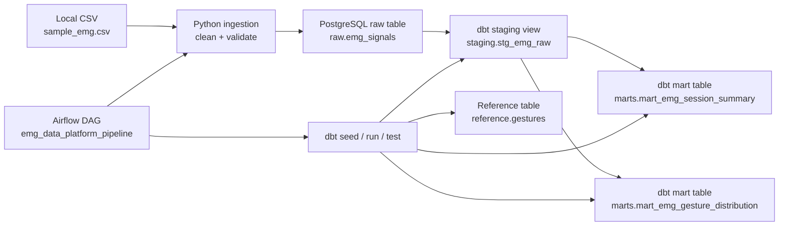
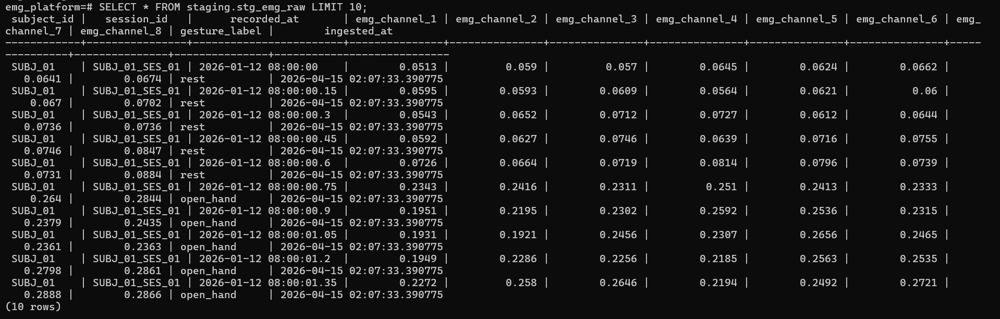
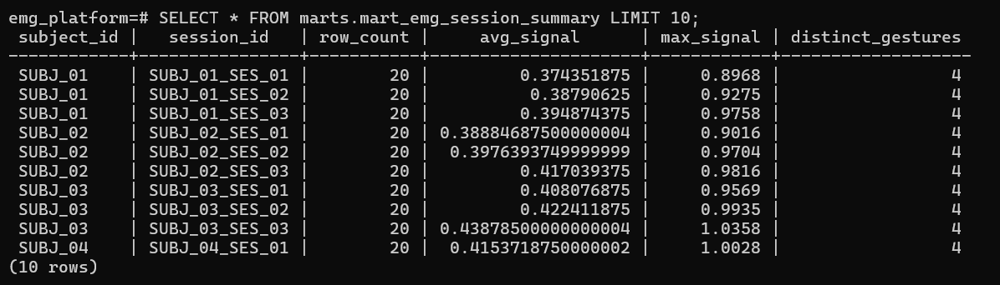
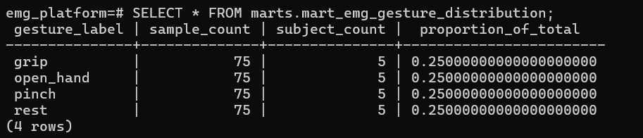

# emg-data-platform

**Status:** Completed portfolio MVP — ingestion, dbt models, tests, and sample outputs are working locally.

## Project overview

`emg-data-platform` is a local-first data engineering portfolio project built around electromyography (EMG) biosignal data. It shows how multi-channel time-series sensor records can be validated in Python, loaded into PostgreSQL, standardized with dbt, and orchestrated with Airflow in a reproducible Docker Compose environment.

The project is intentionally small enough to run on a laptop, but it still demonstrates the core patterns employers expect in production data work:

- validated raw ingestion
- a clear `raw -> staging -> marts` modeling flow
- data quality checks in dbt
- repeatable orchestration with Airflow
- local reproducibility with Docker Compose

## Quickstart

```powershell
# 1. Clone the repository
git clone https://github.com/AmmarHafeez/emg-data-platform.git
cd emg-data-platform

# 2. Create environment file
Copy-Item .env.example .env

# 3. Start PostgreSQL
docker compose up -d postgres

# 4. Create and activate Python virtual environment
py -3.12 -m venv .venv
.\.venv\Scripts\Activate.ps1

# 5. Install dependencies
python -m pip install --upgrade pip
pip install -r requirements.txt
pip install dbt-postgres

# 6. Load raw EMG data
python src\ingest\load_raw_csv.py

# 7. Run dbt models and tests
cd dbt_emg
dbt seed
dbt run
dbt test
cd ..
```

## Why this project matters for Data Engineering

EMG data is a strong data engineering example because it behaves like real telemetry:

- each row is a time-stamped event
- multiple sensor channels must stay schema-consistent
- bad timestamps or null fields can break downstream analysis
- the same data benefits from both detailed raw storage and aggregated analytical models

It is a more technically interesting portfolio domain than a generic ecommerce CSV, while still being easy to explain in interviews.

## Architecture



## Raw -> staging -> marts flow

- `raw.emg_signals`
  Stores the validated sensor samples at the most granular level used by the project. This is the system-of-record layer for the local demo.
- `staging.stg_emg_raw`
  Standardizes names and types for analysis. It trims text fields, renames `timestamp` to `recorded_at`, renames channel columns to `emg_channel_*`, and normalizes gesture labels.
- `marts.mart_emg_session_summary`
  Aggregates the raw signal stream to one row per subject and session.
- `marts.mart_emg_gesture_distribution`
  Aggregates the dataset to one row per gesture label for quick distribution analysis.

This separation keeps ingestion logic simple, dbt models readable, and recruiter review fast.

## Tech stack

- Python 3.12
- PostgreSQL 18
- Docker Compose
- Apache Airflow 3
- dbt Core with `dbt-postgres`
- pandas
- SQLAlchemy
- pytest
- Ruff

## Dataset schema

The raw source table is `raw.emg_signals`.

| Column | Type | Description |
| --- | --- | --- |
| `subject_id` | `TEXT` | Subject identifier |
| `session_id` | `TEXT` | Recording session identifier |
| `timestamp` | `TIMESTAMP` | Time the EMG sample was recorded |
| `channel_1` ... `channel_8` | `DOUBLE PRECISION` | Eight EMG sensor channels |
| `gesture_label` | `TEXT` | Gesture class: `open_hand`, `grip`, `pinch`, `rest` |
| `ingested_at` | `TIMESTAMP` | Load timestamp populated by PostgreSQL |

## Pipeline steps

1. Read the local EMG CSV file.
2. Validate that all required columns exist.
3. Trim whitespace from text fields.
4. Parse `timestamp` into a real datetime.
5. Normalize `gesture_label` to lowercase.
6. Reject rows with null or invalid required values.
7. Load the cleaned records into `raw.emg_signals`.
8. Run dbt seed, dbt models, and dbt tests.
9. Expose session-level and gesture-level marts for analysis.

## dbt models

- `stg_emg_raw`
  Clean staging view over `raw.emg_signals`
- `mart_emg_session_summary`
  One row per `subject_id` and `session_id` with `row_count`, `avg_signal`, `max_signal`, and `distinct_gestures`
- `mart_emg_gesture_distribution`
  One row per `gesture_label` with `sample_count`, `subject_count`, and `proportion_of_total`

dbt tests include:

- `not_null` on key source and model columns
- `accepted_values` on `gesture_label`

## Airflow orchestration

The Airflow DAG runs the project in a simple, recruiter-friendly order:

1. Check PostgreSQL readiness
2. Run the Python ingestion script
3. Run `dbt deps`
4. Run `dbt seed`
5. Run `dbt run`
6. Run `dbt test`

This demonstrates workflow orchestration across ingestion, transformation, and validation without adding unnecessary platform complexity.

## How to run locally

1. Create a local environment file:

```bash
cp .env.example .env
```

On Windows PowerShell:

```powershell
Copy-Item .env.example .env
```

2. Build the local Airflow image and initialize Airflow:

```bash
docker compose up --build airflow-init
```

3. Start the services:

```bash
docker compose up -d postgres airflow-api-server airflow-scheduler airflow-dag-processor
```

4. Open Airflow at `http://localhost:8080`

Default local login:

- username: `airflow`
- password: `airflow`

5. Trigger the DAG `emg_data_platform_pipeline`

Optional manual workflow from the CLI container:

```bash
docker compose --profile tools run --rm airflow-cli bash
```

Inside that container:

```bash
python /opt/emg-data-platform/src/ingest/load_raw_csv.py --csv-path /opt/emg-data-platform/data/raw/sample_emg.csv --truncate-first
dbt seed --project-dir /opt/emg-data-platform/dbt_emg --profiles-dir /opt/emg-data-platform/dbt_emg
dbt run --project-dir /opt/emg-data-platform/dbt_emg --profiles-dir /opt/emg-data-platform/dbt_emg
dbt test --project-dir /opt/emg-data-platform/dbt_emg --profiles-dir /opt/emg-data-platform/dbt_emg
```

## Expected tables created

- `raw.emg_signals`
- `reference.gestures`
- `staging.stg_emg_raw`
- `marts.mart_emg_session_summary`
- `marts.mart_emg_gesture_distribution`


## Sample Outputs

### 1) Staging model: `staging.stg_emg_raw`
This staging model standardizes raw EMG sensor records into a clean, analysis-ready structure with normalized timestamps, channel fields, and gesture labels.



### 2) Mart model: `marts.mart_emg_session_summary`
This mart provides one row per subject session and summarizes row counts, average signal magnitude, maximum signal observed, and the number of distinct gestures recorded.



### 3) Mart model: `marts.mart_emg_gesture_distribution`
This mart aggregates the dataset by gesture label and reports total samples, contributing subjects, and the proportion of total observations.




## Sample SQL queries recruiters can run

Inspect the session-level summary:

```sql
select
    subject_id,
    session_id,
    row_count,
    avg_signal,
    max_signal,
    distinct_gestures
from marts.mart_emg_session_summary
order by avg_signal desc
limit 10;
```

Inspect gesture distribution across the dataset:

```sql
select
    gesture_label,
    sample_count,
    subject_count,
    round(proportion_of_total * 100, 2) as pct_of_total
from marts.mart_emg_gesture_distribution
order by sample_count desc, gesture_label;
```

Inspect raw session coverage directly from PostgreSQL:

```sql
select
    subject_id,
    session_id,
    min(timestamp) as session_start,
    max(timestamp) as session_end,
    count(*) as sample_count
from raw.emg_signals
group by 1, 2
order by session_start;
```

## Interview talking points

- The project uses the standard analytics engineering structure of `raw -> staging -> marts`, which makes lineage and responsibilities easy to explain.
- The ingestion layer is intentionally defensive: it validates schema, normalizes text and timestamps, rejects bad records, and logs what happened.
- The project is deterministic for demos. Re-running the pipeline refreshes the sample raw data instead of duplicating it.
- EMG is a useful proxy for biosignal, IoT, and telemetry pipelines because it combines timestamps, repeated sessions, multiple sensor channels, and downstream analytical aggregation.

## What this proves to employers

This project demonstrates the ability to:

- design a clean raw-to-marts data flow
- build reliable ingestion with validation and logging
- model analytics-ready tables with dbt
- orchestrate a repeatable pipeline with Airflow
- package a project for local reproducibility with Docker Compose
- work with biosignal and time-series data, where timestamp quality and schema consistency matter

In short, it shows practical end-to-end data engineering skills on a domain that is more technically interesting than a generic CSV-to-dashboard demo.
